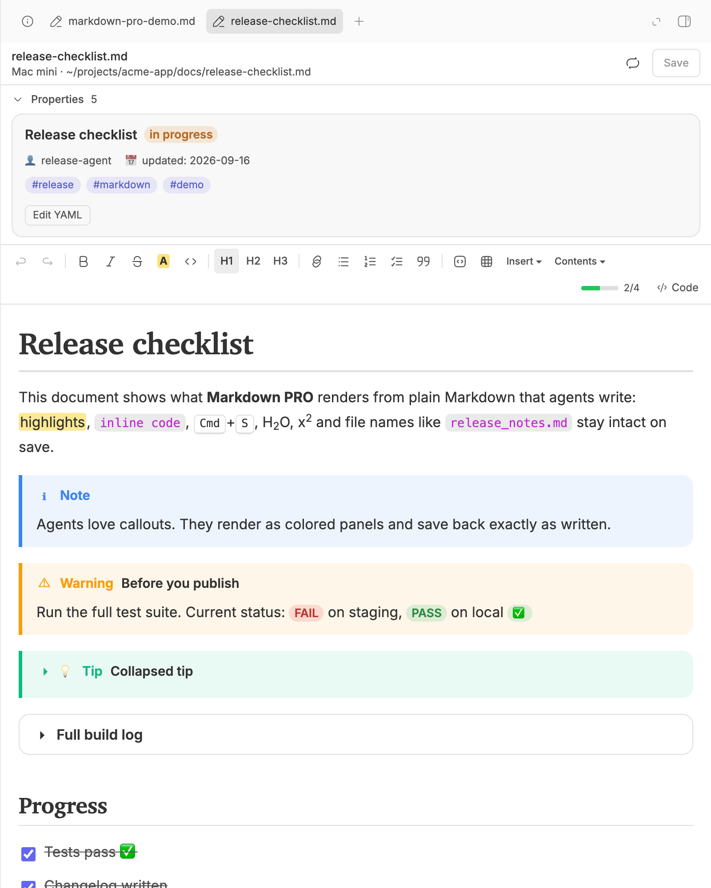
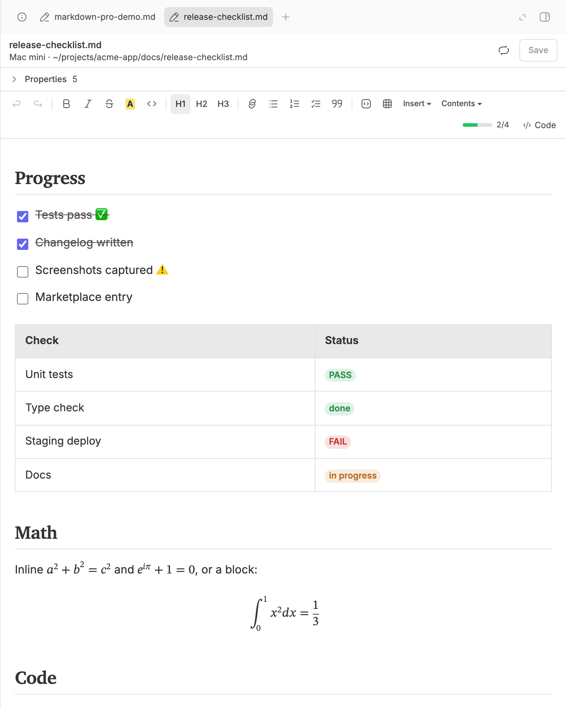
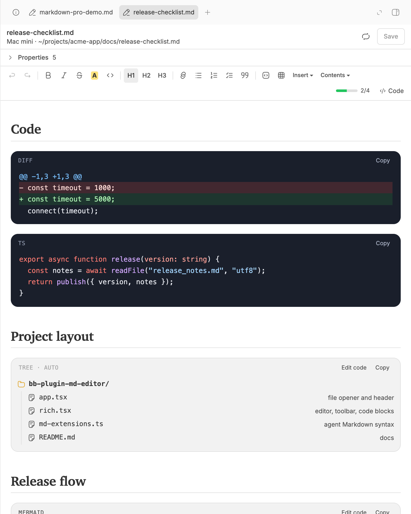
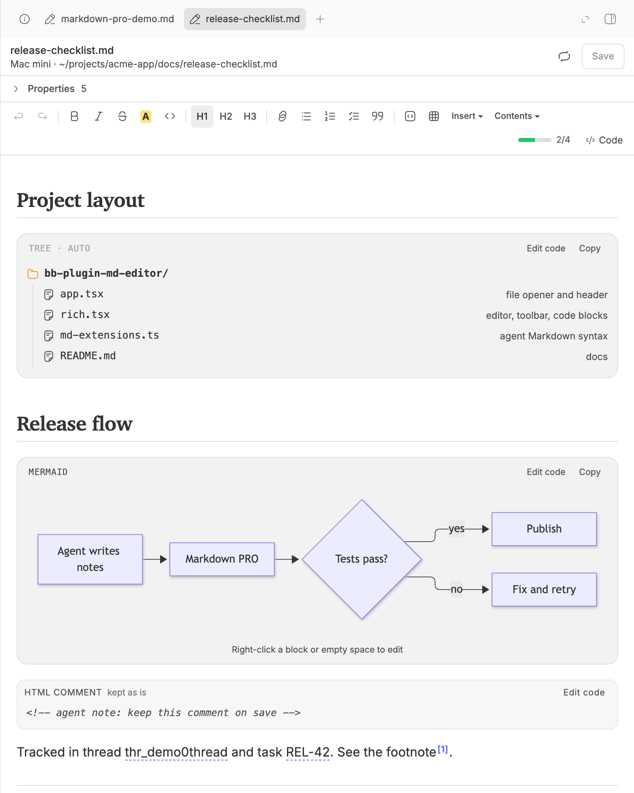
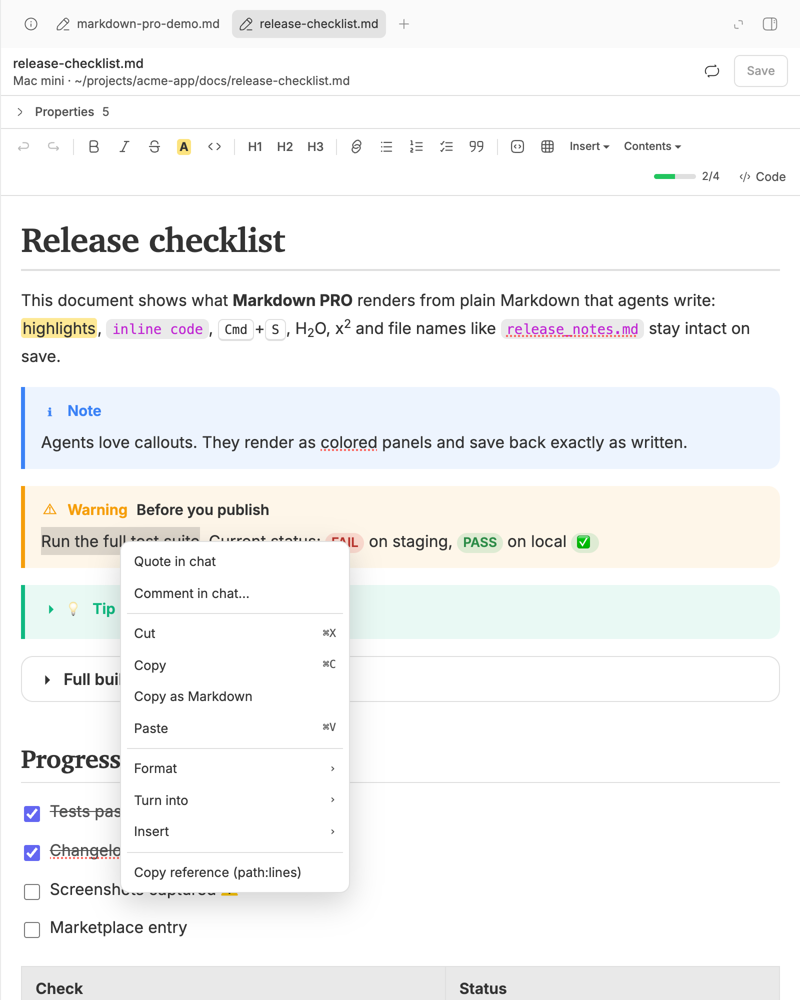

# Markdown PRO for BB

Edit Markdown files in [BB](https://getbb.app) as formatted documents: a style toolbar, GitHub callouts, Mermaid diagrams you can edit with the mouse, LaTeX, syntax-highlighted code, directory trees, YAML properties, and a right-click **Quote in chat** that sends the exact Markdown with file path and line numbers to the agent.



## Features

- **Formatted editing** of `.md`, `.markdown`, `.mdx` from chat links, the file picker, Tasks and `bb thread open`.
- **Agent Markdown preserved on save**: callouts `> [!NOTE]`, `<details>`, footnotes, `<kbd>`/`<sub>`/`<sup>`, `==highlight==`, emoji shortcodes, raw HTML and comments. Opening a file never rewrites it; editing changes only the touched lines. Text such as `file_name.md`, `5*3` or `Map<K, V>` is not escaped.
- **Mermaid** rendering and flowchart editing by right-click (rename, add block or yes/no branch, change shape, delete), plus templates for nine diagram types.
- **LaTeX** with `$…$`, `\(…\)`, `$$…$$`, `\[…\]`.
- **Code blocks** with highlighting for 37 languages and auto-detection, diff colors, JSON formatting, Copy and collapsing of long blocks.
- **Directory trees** (`├──`, `└──`) rendered as a folder tree.
- **YAML front matter** as a properties card with an Edit YAML source view.
- **Status badges** (PASS/FAIL/DONE/TODO, ✅❌⚠️) and clickable BB thread ids and task keys.
- **Right-click menu**: Quote in chat, Comment in chat, cut/copy/copy as Markdown/paste, Format, Turn into, Insert, table/link/image actions, Copy reference (`path:lines`).
- **Machine-aware**: files open from the machine and folder of the originating thread, environment or project; relative links resolve from the document's folder.
- **Safe saving**: autosave with hash-guarded writes, conflict banner when a file changes underneath you, recreate a deleted file.
- **Tab menu** on BB's side panel: close others / left / right / all, pin.
- **Agent skill** `markdown-pro` describing what renders well.

| | |
| --- | --- |
|  |  |
|  |  |

A sample document is in [docs/demo.md](docs/demo.md).

## Install

```sh
bb plugin install https://github.com/VKirill/bb-plugin-md-editor.git
```

Markdown PRO registers as a file opener for `md`, `markdown` and `mdx`. If another plugin also opens these extensions, pick **Markdown PRO (md-editor)** in BB Settings → Files.

Requires BB 0.43 or later. No account, API key or external service.

## Development

```sh
npm install
npm test              # node:test suites: locate, links, front matter, diagrams/trees, markdown round-trip, quotes
npx tsc --noEmit
bb plugin build . && bb plugin install . --yes
```

Layout:

| File | Purpose |
| --- | --- |
| `app.tsx` | File opener: loading, autosave, conflicts, properties, chat quoting |
| `rich.tsx` | Tiptap editor, toolbar, code blocks, Mermaid, trees, images |
| `md-extensions.ts` | Markdown syntax that round-trips (callouts, details, HTML, footnotes, emoji, math) and minimal escaping |
| `views.tsx`, `decorations.ts` | Callout/details/HTML views; status badges and entity links |
| `context-menu.tsx`, `quote.ts` | Editor right-click menu and `path:lines` mapping |
| `mermaid-edit.ts`, `tree.ts` | Flowchart source edits; directory tree parsing |
| `server.ts`, `locate.ts`, `links.ts` | Machine/path resolution, hash-guarded reads and writes, link targets |
| `tabs.ts` | Side-panel tab context menu |
| `skills/markdown-pro` | Agent skill |

The tab menu relies on BB's tab strip data attributes (there is no public extension point for it); if a BB update changes that markup, the menu stops appearing without affecting anything else.

## License

MIT
