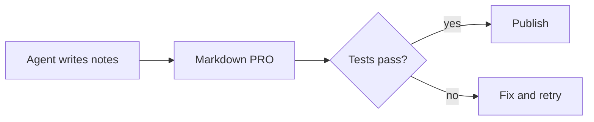

# Release checklist

This document shows what **Markdown PRO** renders from plain Markdown that agents write: ==highlights==, `inline code`, <kbd>Cmd</kbd>+<kbd>S</kbd>, H<sub>2</sub>O, x<sup>2</sup> and file names like `release_notes.md` stay intact on save.

> [!NOTE]
> Agents love callouts. They render as colored panels and save back exactly as written.

> [!WARNING] Before you publish
> Run the full test suite. Current status: FAIL on staging, PASS on local ✅

> [!TIP]- Collapsed tip
> Click the arrow to expand.

<details>
<summary>Full build log</summary>

The build finished in 41 seconds with 0 warnings.

</details>

<!-- demo-region:start -->
Template comment pairs fold in the editor. The start and end markers stay in the file.
<!-- demo-region:end -->

<!-- a lone note for the agent -->

## Progress

- [x] Tests pass :white_check_mark:
- [x] Changelog written
- [ ] Screenshots captured :warning:
- [ ] Marketplace entry

| Check | Status |
| --- | --- |
| Unit tests | PASS |
| Type check | done |
| Staging deploy | FAIL |
| Docs | in progress |

## Math

Inline $a^2 + b^2 = c^2$ and \(e^{i\pi} + 1 = 0\), or a block:

$$
\int_0^1 x^2 \, dx = \frac{1}{3}
$$

## Code

```diff
@@ -1,3 +1,3 @@
- const timeout = 1000;
+ const timeout = 5000;
  connect(timeout);
```

```ts
export async function release(version: string) {
  const notes = await readFile("release_notes.md", "utf8");
  return publish({ version, notes });
}
```

## Project layout

```
bb-plugin-md-editor/
├── app.tsx          # file opener and header
├── rich.tsx         # editor, toolbar, code blocks
├── md-extensions.ts # agent Markdown syntax
└── README.md        // docs
```

## Release flow



<!-- agent note: keep this comment on save -->

Tracked in thread thr_demo0thread and task REL-42. See the footnote[^1].

[^1]: Footnotes render at the bottom and link back from the text.
